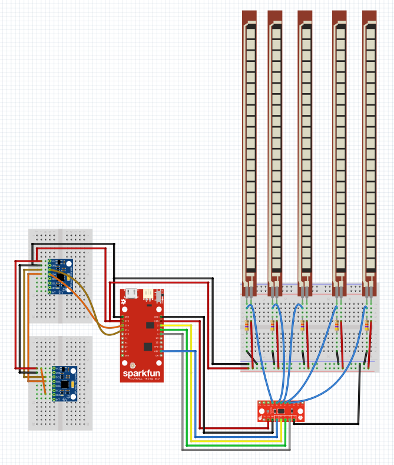
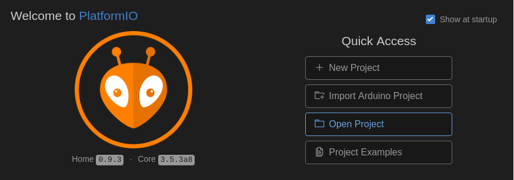

<center><h1>STEPS OF THE PROJECT :</h1></center>

## STEP 1 :
Get all the analog values of the flex sensors using the 74HC4051 multiplexer

## STEP 2 :
 Set the communication between the two ESP8266 (client-server) with the glove as the server and the 3d printed hand as the client.

 Send all the values from the server to the client :
 * The two ESP8266 connect to the access point
 * Server starts
 * Each time the client connects  to the server, the server sends data

## STEP 3 :
Reception of server data on the client-side and action of servo motors according to data received


<center>
 <h1>THIS IS STEP 1 ONLY</h1>
 
 </center>


#### Components :
* Used :
    * ESP8266 Thing Dev (x1)
       * [ESP8266 Datasheet](https://www.espressif.com/sites/default/files/documentation/0a-esp8266ex_datasheet_en.pdf)
       * [ESP8266 Thing Dev Graphical Datasheet](https://cdn.sparkfun.com/datasheets/Wireless/WiFi/ESP8266ThingDevV1.pdf)
       * [ESP8266 Thing Dev Schematic](https://cdn.sparkfun.com/datasheets/Wireless/WiFi/ESP8266-Thing-Dev-v10.pdf)
       * [ESP8266 Thin Dev Hookup Guide](https://learn.sparkfun.com/tutorials/esp8266-thing-development-board-hookup-guide?_ga=2.220320347.2139293805.1523318758-2093697505.1519119166)
       * [ESP8266 Pin List](https://www.espressif.com/sites/default/files/documentation/0d-esp8266_pin_list_release_15-11-2014.xlsx)
    * Flex Sensors (x5)
      * [Flex Sensors Datasheet](https://cdn.sparkfun.com/datasheets/Sensors/ForceFlex/FLEX%20SENSOR%20DATA%20SHEET%202014.pdf)
    * 47 kΩ Resistors (x5)
    * 74HC4051 Multiplexer (x1)
        * [74HC4051 Datasheet](https://assets.nexperia.com/documents/data-sheet/74HC_HCT4051.pdf)
    * Wires


* Not Used :
  * MPU6050 6 DOF IMU (x2)
      * [MPU6050 Datasheet](https://store.invensense.com/datasheets/invensense/MPU-6050_DataSheet_V3%204.pdf)  

We encountered some problems :
Because the I2C bus on the ESP8266 is a software implementation and not a hardware implementation, it means that the driver for I2C  will  be responsible of the delay regulations between the ESP8266 and the I2C sensors. (to regulate the communication between the two). We have tested the I2C driver APPROVED by Espressif (because there is no official I2C driver from Espressif) and other drivers made by internet programers but without success.


* To Do :
    * Change the ESP8266 to the ESP32
        * [ESP32 Ressources](https://www.espressif.com/en/products/hardware/esp32/resources)

 * Change all the resistors
 * Add OP Amp(s)
 * Add a Battery (and add also a JST connector with it )
     * [JST Connector](https://www.sparkfun.com/products/9749)


#### Preview :

<p align=center>

</p>

#### Schematic :

<p align=center>

</p>


#### Files Organization :

* flex final
* img
  * fritzing.png
* lib
  * flex
    * flex.c
    * flex.h
* src
    * main.c
* platformio.ini


#### Getting Started

1. Install [Atom](https://atom.io/)
2. Install [PlatformIO](https://platformio.org/get-started/ide?install=atom)
3. Then clone the repository
```
git clone https://github.com/PI2-TEAM01/Flex
```

4. Open the folder with platformIO
<p align=center>

</p>

#### Use Data with Processing IDE :

<p align=center>

</p>

At the end of the project, we thought of a 3D representation of the hand movements.
It is possible to do it BUT there is a problem because there is no constraints BETWEEN parts.
There are only position constraints.
Maybe we could build a new program to do so ...

We got time to get the data of the glove and to visualize the data in an histogram.


#### NOTE :

* For pin declaration : You can find all the Pin mux register and functions in the file :

 ```
/home/$Your_Personal_Folder/.platformio/packages/framework-esp8266-rtos-sdk/include/espressif/esp8266/pin_mux_register.h
 ```

* If you used ESPCONN objects and that you uploaded a new piece of code to the ESP8266 (that don't use ESPCONN objects at all), you will see that network information are still printed in the serial monitor ...
In order to delete these parameters you need to execute in the user_init() the following single line :

 ```
void user_init(void) {
   system_restore();
  }
  ```
  It will restore the configuration of the ESP including network configuration.
* If you encounter some error(s) during upload :

  1. Connect the Pin 0 of the ESP8266 to the Ground
  2. Turn off
  3. Turn on
  4. Upload again (it should work now)
  5. If it doesn't work change your USB port
